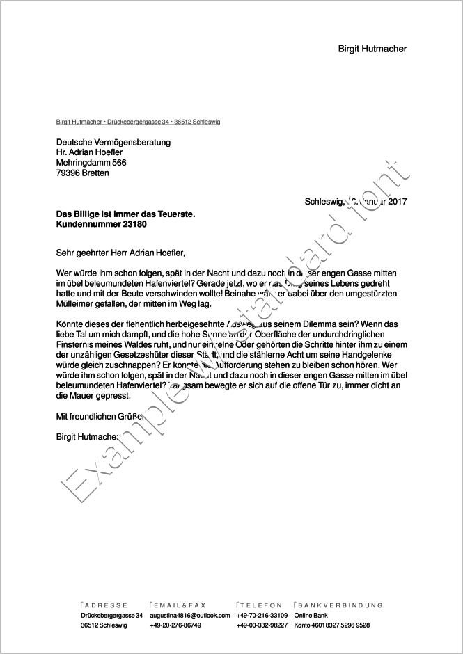

brief-template-lout
===================

Provides a nicely typesetted letter in the Lout_ document formatting
system. It resembles some ideas following the German DIN 5008
standard for (business) letter layouts and should be easy to adopt for
your own needs.

Summary
-------
The file ``brief.lout`` is the basis file holding the content of your
letter, the file ``mybrief`` is a modified copy of the Lout setup file
for ordinary documents supplied with the Lout installation.

You will have to change ``mybrief`` only once when you fill in your
contact data.  

Letters with Lout
-----------------
I do not recommend to use the built-in PDF producer from Lout. The
best results can be achieved by using ``ps2pdf``::

    lout brief.lout > brief.ps && ps2pdf brief.ps

Some examples are provided together with this repository. The final
document using Lout's included standard fonts will look like this:

Customization
-------------
Although the template is intended for German correspondence, an
internationalization should be straightforward. Check the concise Lout
user documentation or start tinkering with the sources right away.

Feel free to deploy it as starting point for your own letters.

If you want to use other than the Lout standart fonts, please have a
look on addfonts_.

Grab a (new) template
---------------------

The dummy letters were generated with the help of Elizabeth for
sourcing some random content. If you have Elizabeth and Python3
installed, you can generate a new dummy letter as a template for your
own by typing:: 

    cd gen-dummy/
    ./randomletter.py

Of course this step is not required and can easly be ignored. Just
adopt the available templates ``mybrief`` and ``brief.lout``.

**Update**: Elizabeth has been replaced by Mimesis_

.. _Lout: https://en.wikipedia.org/wiki/Lout_%28software%29
.. _Mimesis: https://mimesis.name/
.. _addfonts: https://github.com/smartmic/addfonts

